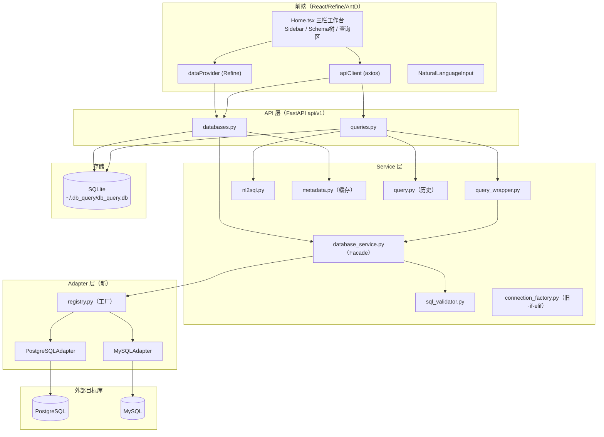
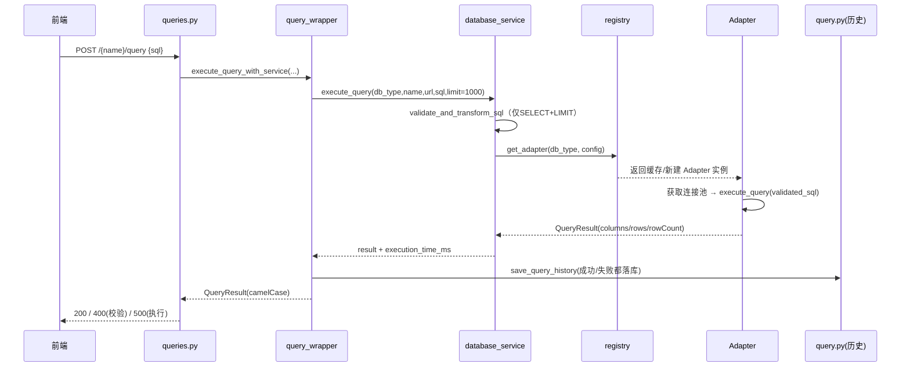
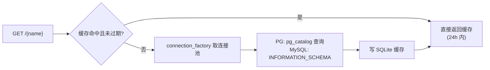
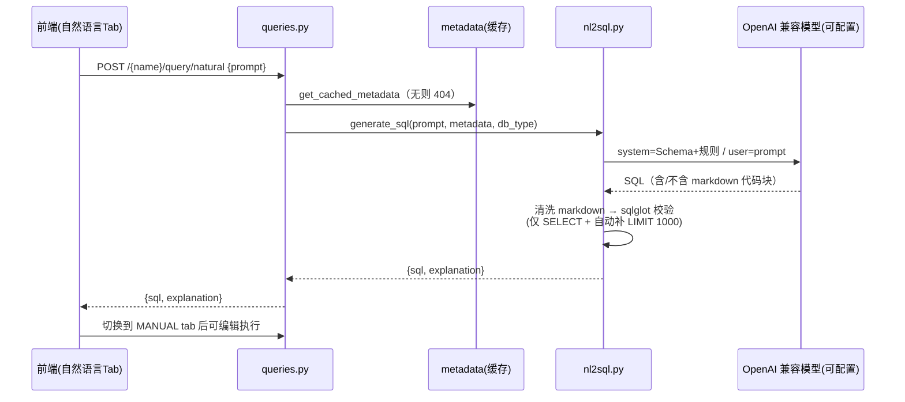
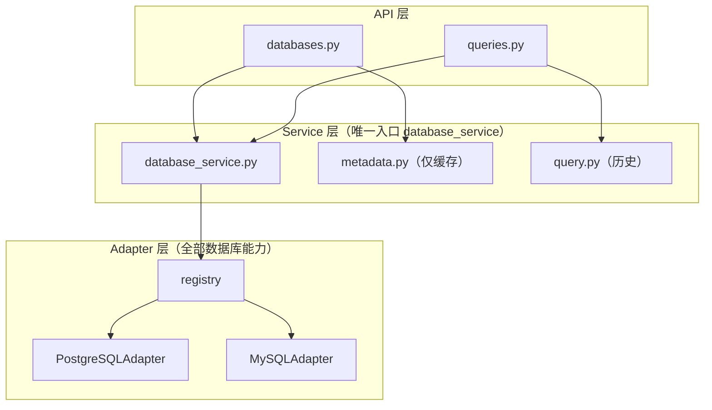

# db_query 数据库查询工具 · 技术架构设计

> 版本：v1.0 · 日期：2026-08-13 · 类型：技术架构设计文档（面向开发团队）
> 参考模板：MotherDuck（多数据库查询产品）· 定位：现状如实描述 + 目标架构演进

---

## §1 系统概述

### 1.1 产品定位

db_query 是一个 Web 端数据库查询工具，核心能力：

1. **多数据库连接管理**：创建/更新/删除 PostgreSQL、MySQL 连接（URL 自动识别类型，创建时即时测试连通性）
2. **元数据浏览**：自动提取表/视图/字段结构（含主键、唯一约束、行数），24 小时缓存
3. **SQL 查询执行**：只读 SELECT（sqlglot 校验，自动补 LIMIT 1000），结果表格化展示
4. **自然语言生成 SQL**：基于 OpenAI（gpt-4o-mini）将中文/英文描述转为 SQL，嵌入数据库 Schema 作为上下文
5. **结果导出**：CSV（RFC 4180）/ JSON 客户端导出，>1 万行弹窗预警

UI 视觉全面对标 MotherDuck：黑色粗边框、Sunbeam Yellow（#FFDE00）顶栏、米色背景（#F4EFEA）、全大写标签。

### 1.2 技术栈

| 层 | 技术 | 说明 |
|---|---|---|
| 后端框架 | FastAPI 0.121+ / Uvicorn | 异步 REST |
| ORM | SQLModel 0.0.27（SQLAlchemy） | 应用状态存 SQLite |
| 数据库驱动 | asyncpg / aiomysql / PyMySQL | 目标库连接 |
| SQL 解析 | sqlglot（rs） | 校验 + dialect 转换 + LIMIT |
| AI | OpenAI 2.8（模型/端点可配置） | 自然语言 → SQL（默认 gpt-4o-mini，可切换 OpenAI 兼容端点） |
| 配置 | pydantic-settings | `.env` 驱动 |
| 前端 | React 18 + TypeScript + Refine 5 + AntD 5 | Vite 7 构建 |
| 编辑器 | Monaco Editor | SQL 编辑 |
| 包管理 | uv（后端）/ npm（前端） | |

### 1.3 设计目标

1. **可扩展（OCP）**：新增数据库类型不修改既有代码（适配器 + 注册表）
2. **双语言查询**：中英文自然语言均可用
3. **一致性**：SQLite 应用态与外部数据库职责分离；API 全 camelCase
4. **UI 对标 MotherDuck**：信息密度高、风格统一

---

## §2 现状架构

### 2.1 分层架构



### 2.2 模块地图

```
backend/app/
├── api/v1/
│   ├── databases.py      # 连接管理 + 元数据端点
│   └── queries.py        # 查询执行 + 历史 + NL2SQL 端点
├── services/
│   ├── database_service.py   # 新 Facade：校验 + 适配器编排 + 计时
│   ├── query_wrapper.py      # 查询执行包装（新路径，含历史落库）
│   ├── nl2sql.py             # OpenAI 自然语言 → SQL
│   ├── sql_validator.py      # sqlglot 校验（仅 SELECT）+ 自动 LIMIT
│   ├── query.py              # 查询执行（旧路径）+ 历史 50 条清理
│   ├── metadata.py           # 元数据提取（旧路径）+ SQLite 缓存 24h
│   ├── connection_factory.py # 旧 if-elif 分发（PG/MySQL）
│   ├── db_connection.py      # 旧 asyncpg 连接池
│   └── mysql_{connection,metadata,query}.py  # 旧 MySQL 对应
├── adapters/               # 新适配器体系
│   ├── base.py             # DatabaseAdapter ABC + dataclass
│   ├── registry.py         # 工厂 + 实例缓存（{type}:{name}）
│   ├── postgresql.py / mysql.py
├── models/
│   ├── database.py         # DatabaseConnection（含 DatabaseType 枚举）
│   ├── metadata.py         # DatabaseMetadata（24h is_stale）
│   ├── query.py            # QueryHistory / QuerySource
│   └── schemas.py          # API 出入参（camelCase 别名）
├── utils/db_parser.py      # URL → DatabaseType 识别
└── database.py             # SQLite engine + get_session
```

### 2.3 关键现状：双路径迁移中间态 ⚠️

项目正按 `docs/ARCHITECTURE_REDESIGN.md` 从旧 if-elif 结构迁移到适配器模式，**两条执行路径并存**：

| 能力 | 现状路径 | 调用链 |
|---|---|---|
| 查询执行 | **新（适配器）** | `queries.py` → `query_wrapper` → `database_service` → `registry` → `Adapter.execute_query` |
| 元数据提取 | **旧（if-elif）** | `databases.py` → `metadata.fetch_metadata` → `connection_factory` → `db_connection/mysql_connection` |
| SQL 校验 | 公共 | `sql_validator`（sqlglot） |
| 连接测试 | **新（适配器）** | `database_service.test_connection` → `registry` → `Adapter.test_connection` |
| 历史落库 | 公共 | `query.save_query_history` |

> 影响：改查询执行须改 `adapters/`；改元数据提取须改 `services/metadata.py` + `connection_factory.py`（尚未适配化）。这是后续演进的主要矛盾点。

### 2.4 数据存储

- **SQLite（应用态）**：`DatabaseConnection`（连接配置）、`DatabaseMetadata`（元数据 JSON 缓存）、`QueryHistory`（历史）。路径 `~/.db_query/db_query.db`
- **外部 PG/MySQL（目标态）**：实际查询与元数据来源，连接池由适配器/连接工厂管理
- 二者职责分离，勿混淆

### 2.5 现状问题清单

1. **双路径重复**：`query.py` 与 `database_service.py` 逻辑重复（旧路径仅测试引用）
2. **OCP 违反残留**：`connection_factory.py`、`metadata.py` 仍有 `if db_type == ...` 分支
3. **全局连接池状态**：旧 `db_connection.py` 用模块级 dict 管理池，难测试/难生命周期管理
4. **元数据提取未适配化**：与 Adapter 层的 `extract_metadata` 目标重复实现
5. **测试缺口**：`query_wrapper`、`database_service` 无覆盖测试（codegraph 探测确认）
6. **前端双实现**：`pages/databases/show.tsx` 与 `pages/Home.tsx` 功能重复，show.tsx 导出按钮未接线

---

## §3 核心数据流

### 3.1 查询执行流（新路径）



### 3.2 元数据提取流（旧路径 + 缓存）



要点：元数据 JSON 存 SQLite，`is_stale` 判断 24h 过期；`POST /refresh` 强制刷新。

### 3.3 自然语言 NL2SQL 流



设计要点：只生成 SELECT；规则强制 LIMIT ≤1000；MySQL 用反引号标识符；temperature 0.1。模型与 API 端点可配置（`OPENAI_MODEL` / `OPENAI_BASE_URL`，兼容 DeepSeek / 通义 / Ollama / One-API 网关等）；生成结果经 sqlglot 本地校验，非 SELECT 直接报错不回流。

**程序处理细节**（围绕模型生成的四层处理，不依赖模型"自觉"）：

1. **生成前 · Schema 上下文与规则注入**（`nl2sql.py::_build_prompt`）：把元数据转为结构化文本进 system message——每张表列出 `schemaName.name`、行数、列清单（`列名(类型)` + `PRIMARY KEY` / `NOT NULL` / `UNIQUE` 标记）；按 db_type 注入方言规则（MySQL 反引号标识符、LIMIT n；PostgreSQL schema 限定 + 双引号）；硬性约束只生成 SELECT、必须带 LIMIT≤1000、支持中英文、只返回 SQL。
2. **生成参数 · 低温度稳定输出**：`temperature=0.1` + `max_tokens=500`，模型名取 `settings.openai_model`（可配置）。
3. **生成后 · 输出清洗**：剥离模型可能返回的 markdown 代码块包裹文本，还原为纯 SQL。
4. **生成后 · 程序级强校验**（`sql_validator::validate_and_transform_sql`）：sqlglot 重新解析——非 SELECT 抛 `SqlValidationError` 直接报错、不回流坏 SQL；缺 LIMIT 自动补 `LIMIT 1000`；返回 sqlglot 规范化后的 SQL。
5. **不自动执行**：结果仅回填编辑器（`explanation` 为占位拼接），由用户确认后在 MANUAL tab 手动执行；执行时经 `query_wrapper` 再走统一校验 + 历史落库。

### 3.4 连接管理流

`PUT /{name}` → ①名称合法性校验 → ②URL 类型识别/校验（`db_parser`，类型与 URL 冲突则 400）→ ③`test_connection` 即时连通 → ④upsert SQLite → 返回连接信息。删除时先关连接池再删记录。

---

## §4 API 接口设计

### 4.1 REST 端点一览

Base URL：`/api/v1`

| 方法 | 路径 | 说明 | 主要入参 | 响应 |
|---|---|---|---|---|
| GET | `/health` | 健康检查 | - | `{status, version}` |
| GET | `/dbs` | 连接列表 | - | `DatabaseConnectionResponse[]` |
| PUT | `/dbs/{name}` | 创建/更新连接 | `url, dbType?, description` | `DatabaseConnectionResponse` |
| GET | `/dbs/{name}` | 元数据（缓存） | `refresh?=bool` | `DatabaseMetadataResponse` |
| DELETE | `/dbs/{name}` | 删除连接 | - | 204 |
| POST | `/dbs/{name}/refresh` | 强制刷新元数据 | - | `DatabaseMetadataResponse` |
| POST | `/dbs/{name}/query` | 执行 SQL | `sql` | `QueryResult` |
| GET | `/dbs/{name}/history` | 查询历史 | `limit?=50` | `QueryHistoryEntry[]` |
| POST | `/dbs/{name}/query/natural` | 自然语言生成 SQL | `prompt(5-500)` | `{sql, explanation}` |

### 4.2 命名与序列化约定

- **API 一律 camelCase**：Pydantic 用 `Field(alias="dbType"|"databaseName"|"rowCount"|"executionTimeMs"|...)`，实体内部 snake_case
- **SQL 校验规则**：仅 `SELECT`；无 LIMIT 自动补 `LIMIT 1000`；按 db_type 选 sqlglot dialect
- **类型识别**：`postgresql/postgres` → PG；`mysql/mysql+pymysql/mysql+aiomysql` → MySQL

### 4.3 错误处理规范

| 场景 | HTTP 码 | detail 示例 |
|---|---|---|
| 名称含非法字符 | 400 | "Name must contain only alphanumeric..." |
| URL 类型与 dbType 冲突 | 400 | "Database type mismatch: ..." |
| 连接测试失败 | 400 | "Connection test failed: ..." |
| SQL 校验失败 | 400 | "Only SELECT statements are allowed" |
| 连接不存在 | 404 | "Database connection 'x' not found" |
| 无元数据缓存 | 404 | "Metadata not found...refresh metadata first" |
| 执行/OpenAI 失败 | 500 | "Query execution failed: ..." |

---

## §5 对标 MotherDuck 分析

### 5.1 MotherDuck 架构要点回顾

MotherDuck 是 DuckDB 的云托管服务，其 Web 工作台核心设计：

- **统一 Catalog**：数据库/模式/表/视图统一的目录树，支持 attach 多个数据源
- **查询编辑器**：多标签页、SQL 草稿自动保存、快捷键（Cmd/Ctrl+Enter 执行）
- **结果面板**：表格 + 行数/耗时指标、导出
- **Schema 感知**：NL 查询利用 schema 上下文
- **视觉**：粗边框、高对比、黄色强调色（本项目已复用其风格）

### 5.2 逐模块差距对比

| 模块 | MotherDuck | db_query 现状 | 差距 | 借鉴点 |
|---|---|---|---|---|
| 目录/Catalog | 统一目录树，多源 attach | 单库一棵树，固定 340px 侧栏 | 无多源聚合视图 | §6.3 可选增强 |
| 查询编辑器 | 多标签 + 草稿自动保存 | 单编辑器，内容仅存内存 state | 无草稿持久化 | M3：localStorage 草稿 |
| 结果分页 | 服务端分页 | 前端 Table 分页（全量在内存） | 大结果集吃内存 | M3：后端 offset 分页 |
| 多库支持 | 十余种数据源 | PG/MySQL 两种 | 需适配器扩展 | §8 已具备扩展机制 |
| NL 查询 | schema 感知 + 多轮 | 单轮 prompt → SQL | 本地校验已加，仍无多轮/重试 | M3：多轮对话 |
| 导出 | 多种格式 | CSV/JSON 纯前端 | 无 Excel/服务端导出 | §8.3 |
| 历史 | 最近查询 | 仅 API（前端无 UI） | 无历史界面 | M3 |

### 5.3 可直接借鉴点（低成本高价值）

1. 查询历史前端化（API 已具备 `GET /history`，只差 UI）
2. SQL 草稿 localStorage 自动保存（防刷新丢失）
3. ✅ 生成 SQL 后先本地 sqlglot 校验再回填（已实现，见 §3.3）

---

## §6 目标架构与演进路径

### 6.1 目标架构（完成适配器化）



关键变化：
- **元数据提取迁入 Adapter**：`PostgreSQLAdapter.extract_metadata` / `MySQLAdapter.extract_metadata`，`metadata.py` 只保留缓存读写
- **删除旧文件**：`connection_factory.py`、`db_connection.py`、`mysql_connection.py`、`mysql_metadata.py`、`mysql_query.py`
- **唯一执行入口**：`database_service`（校验 + 适配器 + 计时 + 历史）

### 6.2 演进里程碑（阶段级）

| 里程碑 | 内容 | 验收标准 | 风险 |
|---|---|---|---|
| **M1 元数据适配器化** | 把 PG/MySQL 元数据提取逻辑移入对应 Adapter；`metadata.fetch_metadata` 改为调用 `database_service.extract_metadata`；补 Adapter 层测试 | `GET /{name}` 行为不变；`metadata.py` 不再 import `connection_factory`；测试全绿 | 连接池生命周期切换，需回归 |
| **M2 清理旧代码** | 删除 §2.5 旧文件与旧 `query.py::execute_query`；统一入口；补 `query_wrapper`/`database_service` 覆盖测试 | 全仓无旧路径 import；`make test` 通过 | 潜在死引用需 grep 排查 |
| **M3 对标增强** | 查询历史前端化、SQL 草稿 localStorage、结果后端分页 | 对应功能可用；`npm run build` 通过 | 范围控制，避免蔓延 |

### 6.3 风险与对策

1. **连接池迁移影响**：M1 从旧工厂切到 Adapter 池时，用 `registry.close_adapter` 确保旧池关闭，避免泄漏
2. **测试覆盖补全**：codegraph 已标记 `query_wrapper`/`database_service` 无覆盖，M2 强制补测试
3. **范围蔓延**：M3 拆细，每项独立可验收

---

## §7 部署与运维（生产化建议）

### 7.1 当前形态

本地开发：`uv run uvicorn app.main:app --reload` + `npm run dev`；应用态 SQLite 在 `~/.db_query/`。

### 7.2 生产化建议（务实，不强制容器化）

1. **配置**：敏感项（OpenAI Key、连接 URL）一律环境变量注入，`.env` 不入库；`config.py` 已支持（含 `OPENAI_MODEL` / `OPENAI_BASE_URL` 模型切换）
2. **日志**：接入结构化日志（当前仅 `logging` 基础用法），`LOG_LEVEL` 环境变量控制
3. **进程守护**：Linux 用 systemd / supervisor 拉起 uvicorn（`--workers N`），Windows 用 NSSM
4. **数据备份**：SQLite 定时备份（`sqlite3 .backup`）或迁移到 MySQL/PG 存应用态；`alembic upgrade` 纳入发布流程
5. **API 网关/鉴权**：外部暴露时前置反向代理（Nginx）+ 简单 Bearer 鉴权；SQL 校验已限只读
6. **健康检查**：已有 `GET /health`，接入负载均衡探活
7. **AI 限流**：OpenAI 调用加后端限流/超时，避免慢查询阻塞

---

## §8 扩展性设计

### 8.1 新增数据库类型（5 步）


必须实现 7 个抽象方法：`test_connection` / `get_connection_pool` / `close_connection_pool` / `extract_metadata` / `execute_query` / `get_dialect_name` / `get_identifier_quote_char`。详细模板见 `app/adapters/README.md` 与 `docs/QUICK_REFERENCE.md`。

### 8.2 插件化机制

- **运行时注册**：`adapter_registry.register(DatabaseType.X, XAdapter)` 可在不改既有代码下挂载外部插件
- **能力集**（未来）：Adapter 暴露 `capabilities`，上层按 `supports()` 决定可用功能（如事务、流式）

### 8.3 未来功能扩展清单

- Excel（.xlsx）导出；服务端导出解决大结果集内存问题
- 查询历史前端页（API 已备）
- SQL 优化建议 / 查询解释
- 结果集后端分页（应对大表）

---

## §9 附录

### 9.1 术语表

| 术语 | 说明 |
|---|---|
| Adapter | 数据库适配器，抽象外部库的连接/查询/元数据能力 |
| Registry | 适配器注册表（工厂模式），按 `{db_type}:{name}` 缓存实例 |
| 应用态 SQLite | 存连接配置、元数据缓存、查询历史的本地库 |
| NL2SQL | 自然语言 → SQL |
| OCP | 开闭原则（对扩展开放、对修改封闭） |

### 9.2 参考资料

- `docs/ARCHITECTURE_REDESIGN.md`（迁移设计依据）
- `docs/QUICK_REFERENCE.md`（适配器扩展速查）
- `app/adapters/README.md`（新增数据库指南）
- `PHASE3_IMPLEMENTATION.md`（NL + 导出功能实现说明）
- MotherDuck 官方文档与工作台（UI 对标来源）
